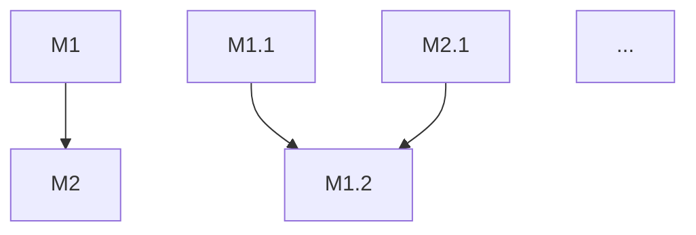

# spec 模板

落点：`docs/spec.md`（项目级一份）

```markdown
# {项目名} 规约 ({版本号})

> 业务层 → docs/prd.md（关联：本文件的 Mx 模块对应 prd.md 的 Mx）

## 0. 元信息
- 状态：草稿 / 已确认
- 日期：YYYY-MM-DD
- 决策人：xxx

## 1. 项目定位
这是什么 · 核心定位 · 不做什么（非目标）

## 2. 核心口径
（规约层内容：数据结构 / 分类标准 / 公式 / 约束 —— 跨子需求共享的口径）

## 3. 架构概览（完整档才写）

### 3.1 技术底座
语言 / 框架 / 运行时，版本号写死

### 3.2 目录与模块边界
代码放哪、边界在哪、什么不许跨

### 3.3 存储与通信
数据存哪、模块之间怎么通信

### 3.4 部署与运行
怎么起、怎么发

### 3.5 约定
命名 / 错误码 / 日志 / 配置 / 测试组织

### 3.6 选型记录
每条：选什么 · 理由 · 被否决的替代方案

## 4. 功能需求

### 需求树（依赖图）



### M1 {模块名} 🟢⏳⬜🗑
模块概要（完整档才写）：
- 职责：一句话
- 输入：...
- 输出：...
- 依赖：无
- 被谁依赖：M2

#### M1.1 {子需求名} 🟢⏳⬜🗑
- **验收**：可执行命令 / 可观察现象
- **依赖**：无

详细设计：
- 数据流：
- 接口：签名 / 入参出参 / 错误码 / 幂等性
- 数据结构：字段 + 约束 + 索引
- 算法与规则：
- 错误与边界：异常路径 / 并发 / 超时 / 空值 / 越界
- 测试要点：对应哪条验收标准

#### M1.2 {子需求名}
...

### M2 {模块名}
...

## 5. 不在范围内
明确不做什么。非目标必须写。

## 6. 待定项
| # | 待定 | 谁来定 | 何时必须定 |
|---|---|---|---|
| 1 | ... | ... | ... |

## 7. 功能实现调整日志（快道）
| 日期 | 调整内容 | 实现（改在哪） | 测试验收 | 判定依据（对照哪条 Mx.y 验收标准） |
|---|---|---|---|---|
| | | | | |
```

## 写作要点

**非目标**：写得出「这次不做什么」吗？写不出说明范围还没想清。

**需求树**：必须有 mermaid flowchart，不显式画就是没完成。编号只做 ID，依赖关系全在箭头里。

**验收标准**：写成可执行的 —— 一条命令、一段脚本、一个可观察现象。写不出可执行的，说明子需求还没想清。

**详细设计**：照着它能写码，不用再回来问。错误路径和正常路径一样详细。

**待定项**：每项都有主有期。无主无期的 TBD 一律当阻塞处理。

## 合格线（写完逐条过）

- [ ] 非目标写了吗？
- [ ] 有需求树（mermaid flowchart）吗？
- [ ] 每个模块的顺序是依赖序吗（被依赖者在前）？
- [ ] 每个子需求的验收标准可判吗 —— 可执行命令或可观察现象？
- [ ] 模块 Mx 和子需求 Mx.y 编号锁定了吗 —— 不会重排？
- [ ] 详细设计（若写）的六个字段都齐吗？错误路径和正常路径一样详细吗？
- [ ] 架构概览（若写）每个选型都带理由 + 被否决的替代方案吗？
- [ ] 版本号写死了吗（不是「Python 3」而是「Python 3.12」）？
- [ ] 每条待定项都有主有期吗？
- [ ] 通读一遍：需要跳读才能理解吗？
